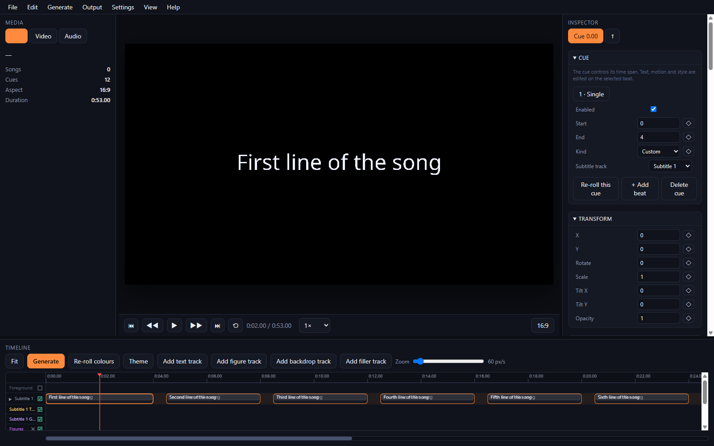

# TelopMotion

> 日本語版: [README.ja.md](README.ja.md) ｜ English (this file)

A desktop app for **lyric videos**. The app opens in the **Studio**: import lyrics (SRT, LRC or JSON), restructure them into beats, render vector text with WebGL2 shaders, animate every group, and export a video. Start a project without any data and build it by hand, or import lyrics to get going.

   

**[Web version → https://gadget114514.github.io/TelopMotion/](https://gadget114514.github.io/TelopMotion/)**

## Features

- **Studio (main)**: turn lyrics into a video project — SRT / LRC / JSON import, text restructuring into beats (pages, recap, repeats), vector text rendering with WebGL2 shaders, 12 motion and effect groups, 20 page layout presets, a multi-track timeline with keyframes, an inspector with manual editing, and synchronized audio and video playback
- **Multi-track timeline**: Subtitle tracks, procedural Figure tracks, customizable Backdrop tracks (`+ Backdrop`), Video tracks (`+ Video`), pattern fillers, video/image layers, and credits
- **Video tracks & chroma key**: a video track sits anywhere in the track list, so the tracks below it draw behind its video and the chroma key (key colour, similarity, smoothness, spill reduction) cuts the key colour out to reveal them through the keyed area
- **Song settings** (*Settings → Song*): name the piece and inform the tempo — the title and the author are shown in the first filler (the intro gap) and in the credits, and the BPM cuts every cue into beats on the bar grid (4/4) and divides the filler gaps bar by bar (0 follows the loaded audio)
- **Granular disable switches**: non-destructively enable or disable individual cues, beats, clips, or subtitle text without losing data or styling (e.g. silence lyrics text while keeping text backgrounds or frame graphics)
- **Simultaneous audio & video playback**: real-time synchronized playback of audio tracks and imported video layers (MP4/WebM) directly in the Studio preview, with frame-accurate scrubbing and WebCodecs export
- **Page layout engine**: 20 publication-style layout presets (magazine, fashion, newspaper, twoColumn, manuscript, xCard, chatBubble, cafeMenu, score, poster, and more) with automatic region flow, background decor, and paper styling
- **Searchable text effects catalog**: 376+ curated text effects searchable by name and description in English and Japanese, procedural shape decorations, scalable frame graphics (0.1×–10×), and dynamic font deformations
- **Theme & directing controls**: AI-assisted automatic direction following song sections, theme dialogue controls for scale randomization, repeat scaling with weird threshold (`>= 0.6`), independent background clocks, and a classified 800-look runtime pool
- **Lyrics import & export**: SRT (tags, `{fx:}`, spans), LRC (metadata, offset, multiple tags, instrumental markers, enhanced word tags), and JSON (arrays, `cues`, Whisper `segments`, seconds/ms/time strings)
- **Five languages**: English, Japanese, Spanish, French, Russian (auto-detected, switchable)

## Studio overview



The app opens directly in the Studio. Click **Start without data** to build a project by hand, or import lyrics (SRT / LRC / JSON) to get going.

The Studio turns lyrics into a video project:

- **Media** (left): project info and the tempo the beats follow (info tab), video imports with thumbnails and background/foreground layer actions (video tab), and the audio tab with waveform and spectrogram once a track is loaded
- **Preview** (center): the rendered frame at output resolution; the overlay shows selection handles, guides and the `path` layout points, with simultaneous audio and video layer playback
- **Preview quality** (*Settings → Quality*, auto/full/half/quarter): the scene is laid out at the size of the frame actually rendered, so a reduced quality draws the same picture smaller and faster instead of a differently-scaled one (the same rule covers video exports at 720p/1440p and the 2D fallback)
- **Inspector** (right): cue/beat text and timing, enable/disable switches, delete buttons in headers, text style, transform, page layout dialog, motion presets search dialog, text background / frame graphics controls, every effect group with its parameters and motion (in/out easing, stagger, loop), colors, and ◆ keyframe buttons
- **Timeline** (bottom): multi-track layout (subtitle, figure, backdrop, filler, background), ruler, audio waveform, cue blocks with beat sub-blocks, element lanes with keyframes (drag, copy/paste, ease, delete), markers, snapping to seconds and frames, independent FG/BG layer toggles, and track creation (`+ Track`, `+ Figure`, `+ Backdrop`)

Text is laid out with `Intl.Segmenter`, converted to glyph outlines with opentype.js, triangulated with earcut, and drawn on WebGL2; every motion runs through the same tween system (`SA.tween`) so preview and export behave identically. The renderer is deterministic: all randomness comes from seeded generators, so the same project at the same time always looks the same.

### Multi-track timeline & layer architecture

The Studio timeline supports rich multi-track composition with independent layer visibility:

- **Subtitle tracks**: hold lyrics cues broken down into beats. Each track provides controls to mute the track, hide subtitle text, hide text backgrounds, or hide frame graphics. Disabling subtitle text silences the lyrics while keeping text backgrounds or decorative frame graphics active.
- **Figure tracks**: generative procedural motifs and vector shapes that complement the lyrics. Figure tracks feature independent foreground (FG) and background (BG) layer toggles, allowing figure graphics to sit either in front of or behind text.
- **Backdrop tracks**: dedicated visual layers for split-screen compositions, geometric patterns, and color planes. Add backdrop tracks with the `+ Backdrop` button in the timeline toolbar. Backdrop tracks feature independent FG/BG visibility and enable controls.
- **Background & Filler tracks**: pattern fillers and generative gap clips that fill instrumental breaks and silence between cues. With a tempo informed (*Settings → Song*) a gap is divided bar by bar, so the track carries one clip per bar; the credits layer stays on the first bar, so the song is named once and the later bars keep moving.
- **Layer render order** ([doc/text-layer-design.md](doc/text-layer-design.md)):
  1. Background clips → Background layers (image/solid/video)
  2. Backdrop clips → Filler clips → Figure / Text-animation clips
  3. Subtitle track layers:
     - Ornaments & Text backgrounds (cell squares / em ornaments)
     - Glyph mask & blur
     - Background knockout & commit
     - Repeat copies & SDF
     - Clones & representation strokes
     - Inner/outer edges & fill
     - Scoped decorations
     - Text post-processing
  4. Foreground layers
  5. Frame post-processing, bloom, and final compositing

  A **Video track** splits that order: it is drawn where it sits in the track list, so everything above it draws in front and everything below it draws behind its video. With a chroma key the key colour is cut out of the video, and the tracks behind show through there.

### Page layout engine

Beyond linear text and geometric formations, TelopMotion provides a **Page Layout** engine ([doc/page-layout.md](doc/page-layout.md)) for publication-style, editorial, and screen UI typography.

Text is split into distinct functional roles (headline, deck, body, caption, byline, price) flowing through dedicated regions with automatic wrapping, font-scaling, and background decorations (rules, borders, paper washes, bubbles, grids, staves):

| Category | Preset (`type`) | Roles | Decor | Description |
|---|---|---|---|---|
| **Generic** | `flushLeft` | body | none | Left-aligned, 75% width boundary |
| | `center` | body | none | Centered, 80% width boundary |
| | `flushRight` | body | none | Right-aligned, 75% width boundary |
| | `justify` | body | none | Justified lines with balanced margins |
| | `vertical` | body | none | Traditional vertical typography (Japanese / rotated Latin) |
| | `grid` | body (cells) | none | Character-by-character grid arrangement |
| **Editorial** | `magazine` | hero, deck, body, byline | Vertical rule, bold headline bar, accent page number | Feature magazine spread with deck and multi-column body |
| | `fashion` | headline, body | Corner L-brackets, hairline vertical rule | Mode magazine layout with generous margins and tracking |
| | `newspaper` | headline, columns, dateline | Double horizontal rules, column rules, drop cap | Classic newspaper article with multi-column text flow |
| | `twoColumn` | columns (2 cols) | Hairline vertical divider | Two-column layout for narrative or spoken lyrics |
| | `threeColumn` | columns (3 cols) | Hairline vertical dividers | Three-column spread (auto-fallback to 2 columns in portrait) |
| | `manuscript` | title, cells (20×20) | Outer border, grid cell lines, center fish-tail mark | Traditional Japanese Genko Yoshi manuscript paper |
| **Screen UI** | `xCard` | name, handle, body, time | Rounded card, border, avatar circle, X mark, action icons | Social media post card layout |
| | `chatBubble` | bubble (per line) | Alternating left/right speech bubbles with tails | Messaging app dialogue bubbles |
| **Shop** | `cafeSign` | headline, sub, est | Chalkboard ground, double border, coffee/star motifs | Chalkboard cafe or bakery sidewalk sign |
| | `cafeMenu` | title, name/price | Dotted leaders, decorative borders | Cafe menu with automatic item and price separation |
| | `boutique` | title, body, sign | Hairline rules, minimal logo circle, spacious margins | Elegant luxury boutique product description card |
| **Music** | `score` | staves, notes | 5-line musical staff, barlines, note stems | Musical staff with lyrics positioned along pitch curves |
| **Poster** | `poster` | hero, captions | Geometric color planes, hairline rules, crosshair crop marks | Graphic design poster with massive hero word and scattered captions |
| **None** | `none` | — | — | Standard single-block layout |

Configure page layouts via the **Page** section in the Inspector or the dedicated Page Layout Dialog (*Inspector → Page Layout…*).

### Effect groups & searchable catalog

TelopMotion organizes visual styling across 12 effect groups:

Animation · Layout · Page · Enter · Exit · Hold · Location · Fill · Edge · Post · Background · Color

- **Searchable effect catalog**: over 376 curated text effects ([doc/text-effects-en.csv](doc/text-effects-en.csv)) searchable by English or Japanese names and visual descriptions in the Motion Presets dialog (*Inspector → Search Presets*).
- **Decomposition axes**: detailed in [doc/textdecor2.md](doc/textdecor2.md) (glyph source, contour ops, deformation, representation, texture, visibility, driver, placement, timing, duplication, layering, scope).
- **Dynamic font size & vertex deformations**: letter blocks scale smoothly around their own center (`hold.fontSize`, `hold.fillScreen`, `enter.megaZoomIn`, `exit.megaZoomOut`). Three vertex shader deformation slots run `jelly`, `wobbleWarp`, `twist`, `breathing`, `squashStretch`, `swirl`, and `hold.warp` without clipping letter deformations.
- **Text backgrounds & frame graphics**: scale smoothly from 0.1× to 10× with customizable per-beat randomization and base scales configurable in the Theme dialogue.
- **Repeat arrangements**: deterministic repeat patterns with weird-factor scaling (`weird >= 0.6` guarantees repeat arrangements; see [doc/repeat-design.md](doc/repeat-design.md)).
- **Scoped attributes & per-letter color**: apply effects to specific letter scopes (`first`, `last`, `alternate`, `nth`), per-letter text colors (`fgColors`), and vertical Japanese / 90°-rotated English columns.

### Simultaneous audio & video playback

- **Synchronized playback**: load audio (MP3, WAV, AAC, etc.) in the Media panel and add video layers (MP4, WebM) in Settings → Layers. When playing the timeline, video layers stay synchronized with the audio track in real time.
- **Scrubbing & seeking**: scrubbing the playhead seeks both audio and video frame-accurately.
- **Media panel analysis**: real-time waveform and spectrogram displays for loaded audio tracks.
- **Audio-reactive bindings**: bind any numeric effect parameter to audio frequency bands (low, mid, high, or RMS) with custom gain and clamping (*Settings → Audio reactive…*).

### Text restructuring

One SRT cue becomes **beats**: split into pages that fit the safe area (with language-aware line breaking for Japanese and English), a full-text recap, repeats for long holds, and emphasis moments. With a tempo informed (*Settings → Song*) the beats are cut on the musical bar grid (one beat per bar, 4/4), so the words are shared between them by reading weight and land on the beat; changing the tempo re-flows every cue. Beats can be edited by hand (drag dividers, split, merge, edit text, pin, or disable) and the rest gets restructured around them.

### Export formats

- **Video**: MP4 (H.264 + AAC; Opus fallback) and WebM (VP9 + Opus) via WebCodecs, with a streaming save target in Electron and the File System Access API on the web. Choose format, resolution (720p/1080p/1440p), fps (30/60), bitrate, audio, and quality in the export dialog (Ctrl+E); the progress bar shows the ETA and cancels cleanly
- **Transparent export**: a store-only PNG-sequence `.zip` (guaranteed) for alpha output; VP9-alpha WebM is best-effort and depends on the platform
- **Layers**: background and foreground layers (solid colours, images with alpha, and video layers), each with opacity, blend mode (normal/add/multiply/screen), fit (cover/contain/stretch/actual), corner radius and transform (position/scale/rotation); edit them in Settings → Layers…
- **Project**: `.telopmotion.json`
- **Lyrics**: SRT (with or without `{fx:}` tags), LRC and JSON (Output → Export lyrics)

## Web version (GitHub Pages)

The same `renderer/` folder is served as a static site. In the web build:

- Opening `studio.html` directly works: start without data or import lyrics (SRT / LRC / JSON). Project files and autosave live in IndexedDB.

### Pages setup

The site is deployed from the repository root by `.github/workflows/static.yml` (the standard GitHub Pages "Static HTML" workflow), which uploads the whole repository on every push to `main`. The committed root `index.html` redirects to `renderer/studio.html` (the Studio is the main mode), so the app is served at `https://<user>.github.io/<repo>/`.

GitHub Pages must use the **GitHub Actions** source once (Settings → Pages → Build and deployment → **Source: GitHub Actions**). A branch deployment also works: with Source `main` / `(root)`, the same root `index.html` serves the app without any workflow. The root `.nojekyll` keeps Pages from running Jekyll over the repository.

## Font licenses

The Studio ships with static OFL fonts in `renderer/fonts/` (Noto Sans Regular/Bold, Noto Serif Regular, Noto Sans JP Regular/Bold, Dela Gothic One, Bebas Neue). They are licensed under the SIL Open Font License 1.1; see `renderer/fonts/OFL.txt` and `renderer/fonts/SOURCES.md` for versions and source URLs. The vendored libraries (`opentype.js`, `earcut`, `mp4-muxer`, `webm-muxer`) keep their own licenses in `renderer/vendor/LICENSES.txt`.

## Requirements

- Windows 10/11 (x64)
- Node.js 18+ for development (tested with Node 24)

## Getting started

```bash
npm install
npm start
```

The app opens in the Studio. Import lyrics with *File → Import lyrics (SRT / LRC / JSON)…*, or press **Start without data** to build a project by hand.

## Building Windows installers

```bash
npm run dist
```

Outputs to `dist/`:

- `TelopMotion-Setup-1.0.0.exe` — NSIS installer (choose install directory)
- `TelopMotion-Portable-1.0.0.exe` — portable, no installation needed

Builds are unsigned, so Windows SmartScreen may show a warning. `dist/win-unpacked/` contains the unpacked app; the smoke tests (`SA_SMOKE=1 SA_SMOKE_LYRICS=1 "dist\win-unpacked\TelopMotion.exe"`) verify that fonts and vendor files load from the packaged bundle.

## Project layout

```
doc/                    Architecture & design docs: page-layout, text-layer, repeat, textdecor2, app-design
main.js                 Electron main process: window, IPC, dialogs, cache, autosave, asset:read
preload.js              contextBridge API exposed to the renderer
scripts/demo30.js       DEMO 30: 30-second showcase reels for auditioning looks
scripts/distinct-count.js Counts perceptually distinct effect signatures
scripts/fx400.js        FX 400: deterministic catalog of representative effects + test project
scripts/fx400mix.js     FX 400 MIX: 400 complete-look demos (headline effect + supporting kit)
scripts/fx800.js        FX 800: 800 numbered, named demos split into four 200-effect projects
scripts/figure-showcase.js Figure showcase: every figure motif + motion axis in one project
scripts/looks-classify.js Classifies the 800 demos (motion magnitude, five axes, themes) for Random look
scripts/check.js        node --check over lib/, scripts/, renderer/js/, main.js, preload.js (223 files)
scripts/vendor.js       Copies opentype/earcut/mp4-muxer/webm-muxer into renderer/vendor
scripts/test/           Unit test suite (91 test files, 1025 tests via node --test)
demo/                   Generated demo projects, cue lists, indexes and preview sheets
renderer/               UI: studio.html (Studio), css/, js/
renderer/js/            Shared: format, platform, srt, lrc, lyrics-json, lyrics-file, color
renderer/js/lyrics/     Lyrics engine: font, geometry, textflow, layout, page-layout, page-scene, motion, scene, engine, looks, shape-ops, pattern-variants, text-effects-data
renderer/js/lyrics/effects/  Effect descriptors + CPU implementations per group (animation, layout, page, enter, exit, hold, location, fill, edge, post, background, color, text-bg, vary, repeat)
renderer/js/lyrics/gl/  WebGL2: context, shaders, SDF, passes, layers
renderer/js/studio/     Studio: project, store, io, menu, preview, timeline, controls, inspector, overlay, page-dialog, motion-dialog, song-dialog, theme-editor, direct
renderer/data/          Generated runtime pool: fx800.looks.json (800 classified looks for Random look)
renderer/fonts/         OFL fonts + SOURCES.md + OFL.txt
renderer/vendor/        Vendored libraries + LICENSES.txt
```

## Testing & tools

```bash
npm run check                       # syntax check every script (223 files ok)
npm test                            # unit test suite (1025 tests across 91 test files)
npm run demo30                      # build 30-second showcase reels (scripts/demo30.js)
npm run distinct                    # count perceptually distinct effect signatures
SA_SMOKE=1 npx electron .           # boot check: Studio loads with no console errors
SA_SMOKE=1 SA_SMOKE_LYRICS=1 npx electron .   # fonts, vector text, holes, audio sync, WebGL fallback
SA_SMOKE=1 SA_SMOKE_BEATS=1 npx electron .    # SRT restructuring: pages, repeats, recap, orphans
SA_SMOKE=1 SA_SMOKE_MOTION=1 npx electron .   # formations, enter/exit/hold types, deform
SA_SMOKE=1 SA_SMOKE_FONT=1 npx electron .     # dynamic font size: fillScreen/fontSize/megaZoom block scale, squash & swirl
SA_SMOKE=1 SA_SMOKE_SHADERS=1 npx electron .  # every fill/edge/post/background type (gl.getError)
SA_SMOKE=1 SA_SMOKE_EDIT=1 npx electron .     # selection, overrides, keyframes, orphans
SA_SMOKE=1 SA_SMOKE_TIMELINE=1 npx electron . # cue edits + SRT, keyframe editing, waveform, snapping
SA_SMOKE=1 SA_SMOKE_STUDIO=1 npx electron .   # Studio shell: menus, undo, autosave, i18n coverage
SA_SMOKE=1 SA_SMOKE_RANDOM=1 npx electron .   # presets, seeded re-roll, locks, palettes, 800-look draw
SA_SMOKE=1 SA_SMOKE_EXPORT=1 npx electron .   # MP4 + AAC, WebM + Opus, transparent PNG zip
SA_SMOKE=1 SA_SMOKE_LAYERS=1 npx electron .   # image/solid/video layers, motion, blends, filters
SA_SMOKE=1 SA_SMOKE_HOME=1 npx electron .     # Studio-first boot without data + lyrics import (SRT/LRC/JSON)
SA_SMOKE=1 SA_SMOKE_SHOT=1 npx electron .     # regenerate snapshot/studio-overview.png (README)
SA_SMOKE=1 SA_SMOKE_QUALITY=1 npx electron .  # full / half / quarter previews render the same frame
SA_SMOKE=1 SA_SMOKE_AUDIO=1 npx electron .    # audio-reactive bindings, simultaneous audio/video playback
SA_SMOKE=1 SA_SMOKE_FILLERS=1 npx electron .  # filler clips, credits modes, timeline and inspector
```

### FX 400 (representative effects)

`test/test_1_to_400.srt` has 400 numbered two-second cues. `scripts/fx400.js` builds a deterministic, numbered catalog of 400 representative effects and a project where cue n carries effect n, so the effects can be checked visually in the Studio:

```bash
npm run fx400 -- build                    # writes test/fx400.catalog.json, test/fx400.md and test/fx400.telopmotion.json
npm run fx400 -- build --text raw         # keep the SRT text (default is a longer sample so letter effects are visible)
npm run fx400 -- show 42                  # prints the recipe for effect 42
npm run fx400 -- apply 42 --project <file> --cue 12 --out <file>   # applies effect 42 to one cue
```

Motion-driven groups (animation, layout, enter, exit, hold, location) are measured with the real motion evaluator against the plain default look: candidates below the perceptual threshold are dropped and near-identical variants are de-duplicated, so the catalog only contains effects that can be told apart. Shader groups keep type identity and only add strong parameter steps. The MD index records the measured score, the verification method and the types that could not produce a visible effect (`hold.none`, `fill.solid`, …).

Open `test/fx400.telopmotion.json` from *File → Open project…* and play the timeline (or scrub) to review the effects. Background effects are applied as clips on the bg track (project version 2 has no cue-level screen background).

### FX 800 (four 200-effect demos)

`scripts/fx800.js` extends the FX MIX sampler to **800 numbered, named demos** — one complete look each (a headline effect plus a supporting kit drawn from the whole registry), sampled so that no two demos are close and each demo differs from the one before it in almost every slot — and splits them into four Studio projects of 200 cues:

| Demo | Numbers | Project | Cue list |
|---:|---|---|---|
| 1 | No.1–200 | `demo/fx800-1.telopmotion.json` | `demo/fx800-1.srt` |
| 2 | No.201–400 | `demo/fx800-2.telopmotion.json` | `demo/fx800-2.srt` |
| 3 | No.401–600 | `demo/fx800-3.telopmotion.json` | `demo/fx800-3.srt` |
| 4 | No.601–800 | `demo/fx800-4.telopmotion.json` | `demo/fx800-4.srt` |

Each project runs 10 minutes at 3 seconds per cue; the cue text carries the demo number and name. `demo/fx800.md` is the numbered index (number, name, supporting kit) and `demo/fx800.catalog.json` stores the full recipes. Every demo's text size steps through the five-look ladder (56 / 70 / 88 / 110 / 138, about 1.3× apart) and its colour cycles through the six readable palette roles, so no two neighbours share both. `SA_SMOKE=1 SA_SMOKE_FXDEMO=1 npx electron .` renders a contact sheet of the first 16 cues to `demo/fx800-preview-1.png` (`_FILE`, `_FROM`, `_COUNT`, `_COLUMNS`, `_TILE`, `_OUT` override).

Pattern backgrounds come from a **1404-kind library** (`renderer/js/lyrics/pattern-variants.js`: 13 animated modes — grid, dots, stripes, rings, triangles, diamonds, hexes, rain, checker, polka, sine curves, waves and random fill — × 9 size steps × 12 element counts) and each demo takes its own step, so a 400/800 demo run never shows the same tiling twice. The same library feeds the backdrop pattern clips that *Random* (auto-direct) creates on the backdrop track; no variant is static, so a backdrop always moves.

```bash
npm run fx800 -- build                     # writes the catalog, index, four projects and the looks pool
npm run fx800 -- show 642                  # prints demo 642 (name, part, recipe)
npm run fx800 -- list --part 3             # lists No.401–600
npm run fx800 -- apply 642 --project <file> --cue 12 --out <file>   # reuse one demo
```

### Figure showcase (motifs and motions)

The `figure` track has its own review project. `scripts/figure-showcase.js` walks **every motif in `figures.MOTIFS`**, one three-second cue each, grouped into the families they are grown from (`base`, `bold`, `proc`, `scene` from `scene3d.js`, `geo` from `figure-geo.js`, `field` — shader and simulation fields from `gl/fields.js`) — and then pins each **motion axis a clip can carry** onto one reference motif (`burst`), so two neighbouring cues differ only in the axis under review:

| Axis | Values |
|---|---|
| `in` / `hold` / `out` | 4 / 4 / 3 moves |
| `sync` | `beat`, `free`, `text` |
| 2D `camera` | 8 moves, applied to the whole clip |
| procedural motion | 17 layer-motion rules (the genome only grows from a seed, so every rule gets the first seed that draws it) |

107 cues in total, about six minutes. Open it from **Help → Figure showcase** (no file hunting) or *File → Open project…*; the queue of every section is in [demo/figure-showcase.md](demo/figure-showcase.md). The cue names come from `studio.figure.*` in all five languages, so the walk is labelled in whatever language the Studio is in. The four GPU-simulation motifs sit behind *Settings → Allow stateful effects* (off by default); opening the showcase turns that gate on for the session only, so they are actually visible.

```bash
npm run figure-showcase -- build                          # writes renderer/data/figure-showcase.json and the index
node scripts/figure-showcase.js list                      # prints the sections and every cue
node scripts/figure-showcase.js list --section camera
npm run figure-showcase -- build --sections base,field    # rebuild only some motif families
```

### Random look

`npm run fx800 -- build` also classifies every demo and writes the runtime pool `renderer/data/fx800.looks.json`: each of the 800 looks carries its measured **motion magnitude** (the SA.motion evaluator samples nine frames of a two-second beat and takes the largest travel / scale / rotation / deform amplitude, bucketed as still / small / medium / large / extreme), a **five-axis profile** (speed, energy, softness, density, brightness) and **theme affinities** (the genre profiles). The styles are stored as deltas against the effect registry defaults, which keeps the whole pool at ~1.9 MB.

The Studio's *Random look* button (Generate menu, timeline ✨, or the Re-roll button) loads the pool and:

1. draws one of the 800 by the song's theme and the five axes — a high `energy` / `speed` target prefers big-motion looks, `softness` the texture, `density` the busyness, `brightness` the tone; a themed draw weights looks that fit that genre
2. applies that look to the whole song (entrance, exit, hold, fill, edge, post, repeat, text background, background clip), so the demo's headline effect stays the face of the song
3. adjusts the fine parameters from the same axes — the palette is regenerated, the text size / spacing follow the density and softness axes, and the demo's typeface survives

Re-rolling excludes the look that is on screen and draws another one. If the pool cannot be loaded, the button falls back to the generator-only theme as before. `demo/fx800.md` lists the motion class of every demo.

## Documentation

Comprehensive architecture, design, and effect documentation:

- [doc/page-layout.md](doc/page-layout.md) — Page layout engine specification, 20 presets, region flow, and decor rendering
- [doc/text-layer-design.md](doc/text-layer-design.md) — Layer rendering pipeline, background knockout, post-effects boundary, and layer separation
- [doc/textdecor2.md](doc/textdecor2.md) — Full effect decomposition across 12 axes, type registry, and roadmap
- [doc/text-effects-en.csv](doc/text-effects-en.csv) — Catalog of 376+ text effects with Japanese and English names, categories, and descriptions
- [doc/repeat-design.md](doc/repeat-design.md) — Repeat arrangement design and distinct signature count
- [doc/app-design.md](doc/app-design.md) — Overall Studio and lyric video engine architecture

## License

MIT
